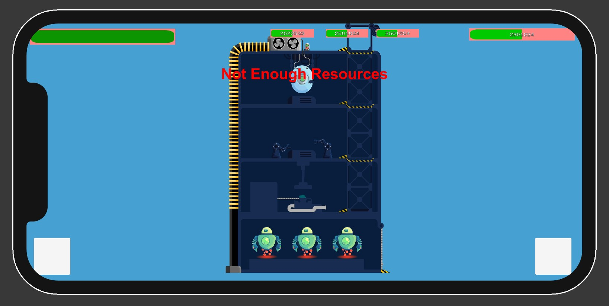

<!-- PROJECT LOGO -->
<br />
<p align="center">
  <a href="https://github.com/target-software/Unlimited-Game-MiningGame">
    
  </a>

  <h3 align="center">UNLIMITED </h3>

  <p align="center">
    README for the Unlimited game [Mining game]
    <br />
    <a href="https://github.com/target-software/Unlimited-Game-MiningGame"><strong>Explore the docs »</strong></a>
    <br />
    <br />
    <a href="https://github.com/target-software/Unlimited-Game-MiningGame">View Demo</a>
    ·
    <a href="https://github.com/target-software/Unlimited-Game-MiningGame/issues">Report Bug</a>
    ·
    <a href="https://github.com/target-software/Unlimited-Game-MiningGame/issues">Request Feature</a>
  </p>
</p>


<!-- TABLE OF CONTENTS -->
<details open="open">
  <summary>Table of Contents</summary>
  <ol>
    <li>
      <a href="#about-the-project">About The Project</a>
      <ul>
        <li><a href="#built-with">Built With</a></li>
      </ul>
    </li>
    <li>
      <a href="#getting-started">Getting Started</a>
      <ul>
        <li><a href="#installation">Installation</a></li>
      </ul>
    </li>
    <li><a href="#usage">Usage</a></li>
    <li><a href="#roadmap">Roadmap</a></li>
    <li><a href="#license">License</a></li>
  </ol>
</details>


<!-- ABOUT THE PROJECT -->
## About The Project



Unlimited Game ... The next 2D social casual game with an interconnected economy system that teach users basic finance and selling skils.

### Built With

* [Unity](https://unity.com/)
<!-- GETTING STARTED -->
## Getting Started

### Installation

1. Clone the repo
   ```sh
   git clone https://github.com/your_username_/Project-Name.git
   ```
2. Open project in Unity


<!-- USAGE EXAMPLES -->
## Usage

More detailes can be found on [Google Drive](https://docs.google.com/document/d/1CHdDfEm5BDM8vAbeubNgLF-Et8YwMgCbreD4CC6dSfo/edit)


<!-- ROADMAP -->
## Roadmap

See the [open issues](https://github.com/target-software/Unlimited-Game-MiningGame/issues) for a list of proposed features (and known issues).


<!-- CONTRIBUTING -->
## Project structure

```bash
< PROJECT ROOT >
   |
   |-- Animations                               
   |-- Editor   
   |-- Fonts 
   |-- Materials
      | -- Shaders
   |-- Meshes
   |-- Plugins
      | -- RainbowAssets
   |-- Prefabs
      | -- Buttons
      | -- Icons
      | -- Robot
   |-- Resources
      | -- Blocks
      | -- Buttons
      | -- IconFolders
      | -- Map
      | -- Panels
      | -- Resources
      | -- Robots
      | -- UI
   |-- Scenes
   |-- Scriptable Objetcs
      | -- Mine Resources
      | -- Player
      | -- Prices
      | -- Robots
   |-- Scripts
      |-- Auxiliary Methods
          |-- AuxiliaryMethods.cs                   #Auxiliary methods that have universal meaning
          |-- ObjectPooling.cs                      #Pools objects for different purposes 
      |-- Bidding   
          |-- ActivateScanning.cs                   #Activates the scanning procedure and handle inputs 
          |-- ScanMine.cs                           #It is responsable for discovering one area as user requested
          |-- StartAuction.cs                       #Start the auction and takes care of time
      |-- Camera Actions
          |-- PanPinch.cs                           #Script for moving the camera using touch input 
          |-- UserTouch.cs                          #Fundamental touch operations simplifiend in methods
      |-- Canvas
          |-- CanvasHelper.cs                       #Helps to resize the canvas to fit in safe area of the phone
      |-- Convert
          |-- ConvertResources.cs                   #Used for converting resources into energy [Converting floor]
      |-- GameErrors
          |-- RaiseGameError.cs                     #Displays on the screen the error that happened {Not enough resources etc}
      |-- Manager Scripts
          |-- GameManager                           #Manage game settings during gameplay
      |-- Mine                      
          |-- Mine Creation Tools
              |-- ShapeTheMine.cs                   #Tool used to shape the mine [Only in unity editor used]
          |-- Values Generation
              |-- GridGeneratePositions.cs          #Generate blocks for the whole 2d array in the map [Only in unity editor used]
              |-- GridHiddenValues.cs               #Generate the hidden values for the blocks in the mine
              |-- GridVisibleValues.cs              #Generate the visible values for the blocks in the mine
          |-- MineEnergyEstimates.cs                #An estimated price of the mine in energy
          |-- MineGenerator.cs                      #Generates the mine [Instantiate tilemap]
          |-- MineTouched.cs                        #Detect if mine is touched and Invokes an event
          |-- RefreshMineValues.cs                  #Refresh the seeds and coeficients for mine generation
          |-- ShowMineDetails.cs                    #Shows more buttons and details about the mine [Enter button, refresh button]         
      |-- Panels     
          |-- BidsDisplayUI.cs                      #Displays the bids in the AuctionScene
          |-- ChangeScreen.cs                       #Used to change screens in the same scene [HQ -- > Map --> HQ]
          |-- ClosePanelUsingBackground.cs          #Used to close any panel touching the background [Outside of panel]
          |-- Confirm.cs                            #Confirmation panel used to make further verification of user decisions 
          |-- OpenPanel.cs                          #Open the desired panel if gameObject is touched
          |-- ProgressBar.cs                        #Handle progress bar values and adjust the visuals for it 
      |-- Pay Operations
          |-- PayRobots.cs                          #Used to make a transaction or refund regarding robots [Build robot --> pay energy]
      |-- Robot 
          |-- DeployRobots.cs                       #
          |-- HallOfFameInstantiateRobots.cs        #Instantiate panel with robots and
          |-- RobotManagerUIForMine.cs              #Instantiate buttons in the mine with all trained robots
          |-- RobotLevelingUp.cs                    #Takes care of robots leveling up
          |-- RobotManager.cs                       #
          |-- RobotPlayerProgress.cs                #Struct that store the level and state [lock/unlocked] of the robot
          |-- RobotsUnlocking.cs                    #Unlocks the robot for user
      |-- Save
          |-- Persistent Data Across Scenes
              |-- GetMineGenerationData.cs          #Static class with data that persist across scenes
              |-- GetRobotsTrained.cs               #Static class with data that persist across scenes
              |-- GetTimeTillAuctionEnds.cs         #Static class with data that persist across scenes
          |-- Serializable Class For Storage Data   
              |-- MineData.cs                       #Serializable class that have the data about the mine | Used to be save in binary format
              |-- TimeData.cs                       #Serializable class that have data about the auction time | Used to be save in binary format
          |-- Values
              |-- ISaveOperations.cs                #Interface for basic SAVE and LOAD operations of any data
              |-- MineValues.cs                     #
              |-- TimeValues.cs                     #
          |-- SaveSystem.cs                         #Saves and Load data
      |-- Scenes Management                      
          |-- ChangeScenes.cs                       #
      |-- Scriptable Objetcts        
          |-- Mine                     
              |-- MineResources.cs                  #
              |-- MineShape.cs                      #Create SO that stores the shape of the mine
          |-- Player
              |-- LevelsThresholds.cs               #SO with all the levels threshold in xp for leveling up
          |-- Resources
              |-- GameResources.cs                  #
              |-- PriceToBuildOrUpgrade.cs          #Used for storing the price in resources [4 resources] of any operation
          |-- Robots
              |-- Robot.cs                          #
              |-- RobotLevel.cs                     #
              |-- StatusRobot.cs                    #
      |-- Stores
          |-- ResourcesOperations.cs                #Operations of removing and adding with the resources [all 4]
          |-- StatBarsOperations.cs                 #Manage values and what is displayed on the stat bars of resources
          |-- StatsOperaions.cs                     #Manage operations of level and Xp
          |-- StoreDataPlayerStats.cs               #
          |-- StoreDaraResources.cs                 #
      |-- Tiles Data                        
          |-- DataOfTile.cs                         #
          |-- StoreAllTiles.cs                      #
          |-- TilesRule.cs                          #
      |-- Timer
          |-- Timer.cs                              #Keeps track of the time during a process
      |-- Train
          |-- BuildRobots.cs                        #
          |-- BuildRobotsOperations.cs              #
          |-- RobotsInBuilding.cs                   #
          |-- RobotsInBuildingOperations.cs         #
          |-- StoreRobots.cs                        #
      |-- Upgrade 
          |-- UpgradeRobots.cs                      #         
   |-- Sounds
   |-- Tiles
  ************************************************************************
```
## Used Plugins and Software

1. [Rainbow Folders 2](https://assetstore.unity.com/packages/tools/utilities/rainbow-folders-2-143526)
2. [DotWeen](https://assetstore.unity.com/packages/tools/animation/dotween-hotween-v2-27676)

<!-- LICENSE -->
## License

Project Template adapted from [Othneil Drew](https://github.com/othneildrew) / [Best-README-Template](https://github.com/othneildrew/Best-README-Template).


<!-- MARKDOWN LINKS & IMAGES -->
<!-- https://www.markdownguide.org/basic-syntax/#reference-style-links -->
[product-screenshot]: images/screenshot.png
