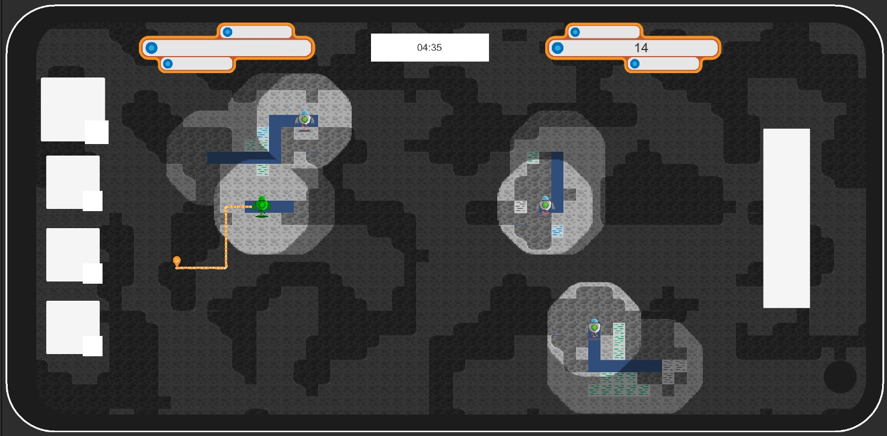

<!-- PROJECT LOGO -->
<br />
<p align="center">
  <a href="https://github.com/target-software/Unlimited-Game-MiningGame">
    
  </a>

  <h3 align="center">UNLIMITED </h3>

  <p align="center">
    README for the Unlimited game [Mining game]
    <br />
    <a href="https://github.com/target-software/Unlimited-Game-MiningGame"><strong>Explore the docs »</strong></a>
    <br />
    <br />
    <a href="https://github.com/target-software/Unlimited-Game-MiningGame">View Demo</a>
    ·
    <a href="https://github.com/target-software/Unlimited-Game-MiningGame/issues">Report Bug</a>
    ·
    <a href="https://github.com/target-software/Unlimited-Game-MiningGame/issues">Request Feature</a>
  </p>
</p>


<!-- TABLE OF CONTENTS -->
<details open="open">
  <summary>Table of Contents</summary>
  <ol>
    <li>
      <a href="#about-the-project">About The Project</a>
      <ul>
        <li><a href="#built-with">Built With</a></li>
      </ul>
    </li>
    <li>
      <a href="#getting-started">Getting Started</a>
      <ul>
        <li><a href="#prerequisites">Prerequisites</a></li>
        <li><a href="#installation">Installation</a></li>
      </ul>
    </li>
    <li><a href="#usage">Usage</a></li>
    <li><a href="#roadmap">Roadmap</a></li>
    <li><a href="#contributing">Contributing</a></li>
    <li><a href="#license">License</a></li>
    <li><a href="#contact">Contact</a></li>
    <li><a href="#acknowledgements">Acknowledgements</a></li>
  </ol>
</details>


<!-- ABOUT THE PROJECT -->
## About The Project



Unlimited Game ... The next 2D social strategy game with an interconnected economy system that teach users basic finance and an entrepreneurial mindset.

### Built With

* [Unity](https://unity.com/)
<!-- GETTING STARTED -->
## Getting Started

### Installation

1. Clone the repo
   ```sh
   git clone https://github.com/your_username_/Project-Name.git
   ```
2. Open project in Unity


<!-- USAGE EXAMPLES -->
## Usage

More detailes can be found on [Google Drive](https://docs.google.com/document/d/1CHdDfEm5BDM8vAbeubNgLF-Et8YwMgCbreD4CC6dSfo/edit)


<!-- ROADMAP -->
## Roadmap

See the [open issues](https://github.com/target-software/Unlimited-Game-MiningGame/issues) for a list of proposed features (and known issues).


<!-- CONTRIBUTING -->
## Project structure

```bash
< PROJECT ROOT >
   |
   |-- Animations                               
   |-- Editor    
   |-- Materials
      | -- Render Textures
      | -- Robot asociated
      | -- Shaders
   |-- Meshes
   |-- Plugins
   |-- Prefabs
      | -- Beacon
      | -- Buttons
      | -- Robot
   |-- Resources
      | -- Beacon
      | -- Blocks
      | -- IconFolders
      | -- MiniMap
      | -- Preview Line
      | -- Robots
      | -- Shapes
      | -- UI
      | -- Waypoints Robot
   |-- Scenes
   |-- Scriptable Objetcs
      | -- Mine Resources
      | -- Robots
   |-- Scripts
      | -- Auxiliary
      | -- Beacon related
      | -- Camera movement
      | -- Canvas
      | -- Manager Scripts
      | -- Mine Generation
          | -- ScriptableObjects
          | -- Values Generation
      | -- Robot Related
          | -- Resources Drop
          | -- Robot Deploy
          | -- Robot Mining Process
              | -- Command Block
              | -- Commands
              | -- Interfaces
              | -- LineRenderer
              | -- Mining Types
              | -- Movement
          | -- Robot Vision
      | -- Scriptable Objetcts
      | -- Tiles
      | -- Touch
   |-- Sounds
   |-- Tiles
  ************************************************************************
```
## Used Plugins and Software

1. [TexturePacker](https://www.codeandweb.com/texturepacker)
1. [Rainbow Folders 2](https://assetstore.unity.com/packages/tools/utilities/rainbow-folders-2-143526)

<!-- LICENSE -->
## License

Project Template adapted from [Othneil Drew](https://github.com/othneildrew) / [Best-README-Template](https://github.com/othneildrew/Best-README-Template).


<!-- MARKDOWN LINKS & IMAGES -->
<!-- https://www.markdownguide.org/basic-syntax/#reference-style-links -->
[product-screenshot]: images/screenshot.png
